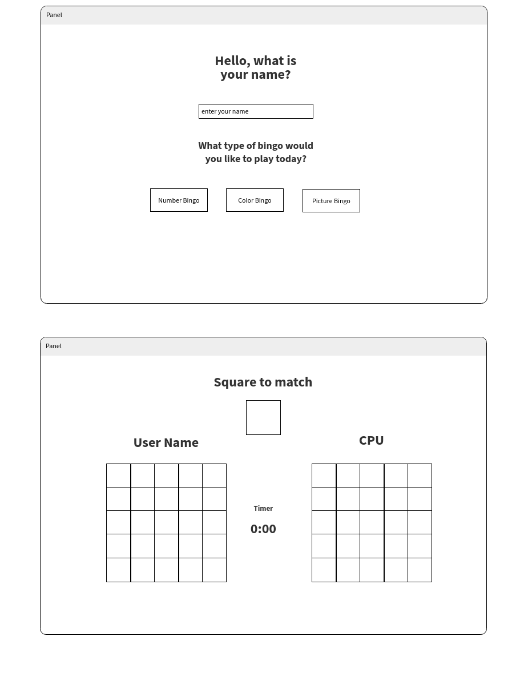

# Two-Player Bingo

## Concept
Two-player bingo app, is a game that the user tries to match their squares with a randomly selected number. The user is also playing against the computer to match 5 numbers in a row, column or diagaonally. The user's turn has a time-limit of 10 seconds. 

## Technologies Used
- HTML
- CSS
- Javascript
- Jquery

## Approach
I intially started out by creating a flowchart of the game. This was very helpful in determining what functions and variables I needed to define. I also built a basic wireframe of the game concept. I also included a wireframe of a menu page for palying different versions of the game, but quickly realized that I did not have the time to create the color or picture versions for this project. 

I approached the development of the game by using Jquery to randomly load the player boards into the dom and check for matches and winner senerios. I used HTML for the basic layout framework and CSS for the styling and hover animations. 

## Challenges
One of the challenges I ran into was generating 2 sets of random numbers for the palyer boards with no duplicates per board and then pulling from a list of all of the numbers currently on the board. I accomplished this by generating an array with a list of numbers 1 thru 50. THen genrating a random Index to pull from the array and place into the array of values to be used in the game. Once the value was in the array for gameplay then it is removed from the original array so no duplicates are created. This is done for each gameboard and the values of both arrays are combined to pull the random number to match. Once the user or CPU matches a number it is removed from the array so it will not be called again. 

## Additonal Info

### Flow Chart

### Wireframe

## App Demo
Take a look at my project hosted on GitHub Pages  
<https://gumtow.github.io/>
